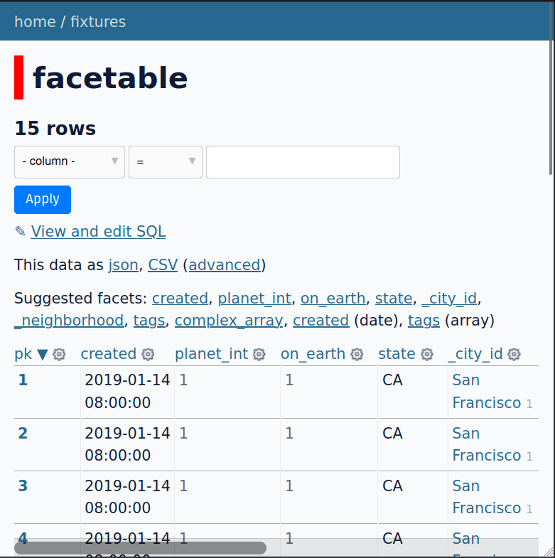

# datasette-horizontal-scroll

[](https://pypi.org/project/datasette-horizontal-scroll/)
[](https://github.com/chimpy-me/datasette-horizontal-scroll/releases)
[](https://github.com/chimpy-me/datasette-horizontal-scroll/actions/workflows/test.yml)
[](https://github.com/chimpy-me/datasette-horizontal-scroll/blob/main/LICENSE)

A Datasette plugin that adds a fixed horizontal scrollbar at the bottom of the viewport when a visible results table is wider than the screen. This makes it easier to horizontally navigate wide tables without needing to hit the native scrollbar on the table itself.



## Installation

Install this plugin in the same environment as Datasette:

```bash
datasette install datasette-horizontal-scroll
```

This plugin depends on Datasette 0.58+ (it uses `datasette.urls.static_plugins()` for serving static assets).

## Usage

Install the plugin and reload Datasette. On table, query, database, and row views, a bottom-of-viewport scrollbar will appear when the active table overflows horizontally.

This plugin serves its assets as packaged static files (CSS/JS) under Datasette's `/-/static-plugins/` mechanism.

## Development

Clone the repository and run the tests:

```bash
pip install -e ".[dev]"
pytest
```

If you use `uv`, you can equivalently run:

```bash
uv run pytest
```

## Releasing / publishing to PyPI

This repository includes a GitHub Actions workflow that can publish releases to PyPI using Trusted Publishing.

Typical release flow:

1. Bump the version in `pyproject.toml`
2. Create and push a git tag (for example: `v0.1`)
3. Create a GitHub Release for that tag (the publish workflow is triggered on `release: published`)
